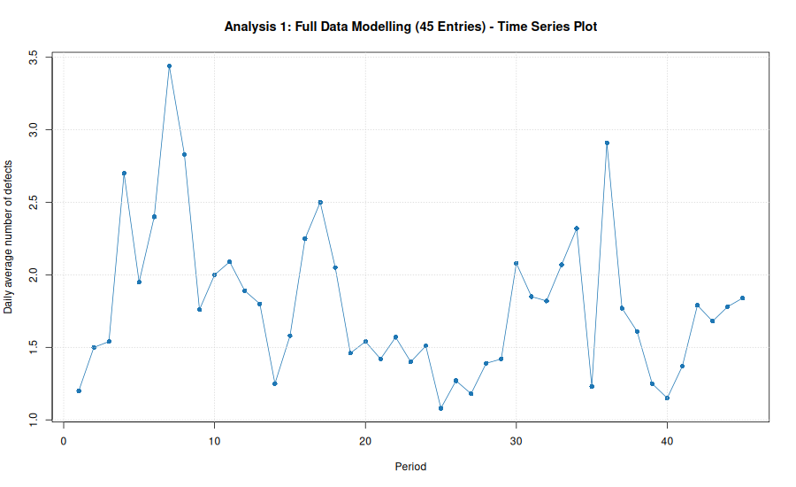
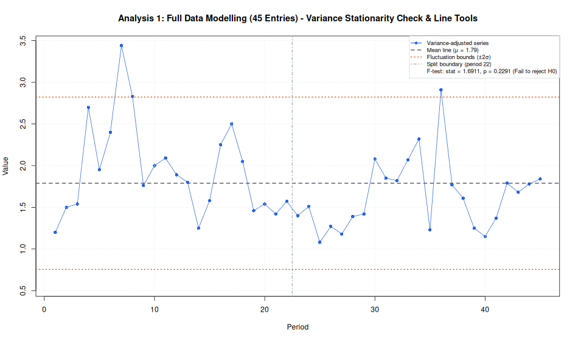
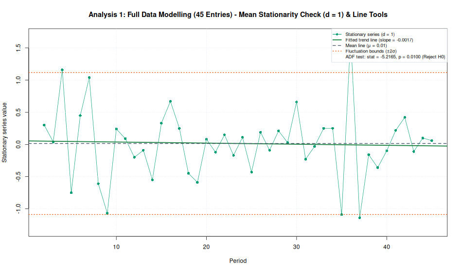
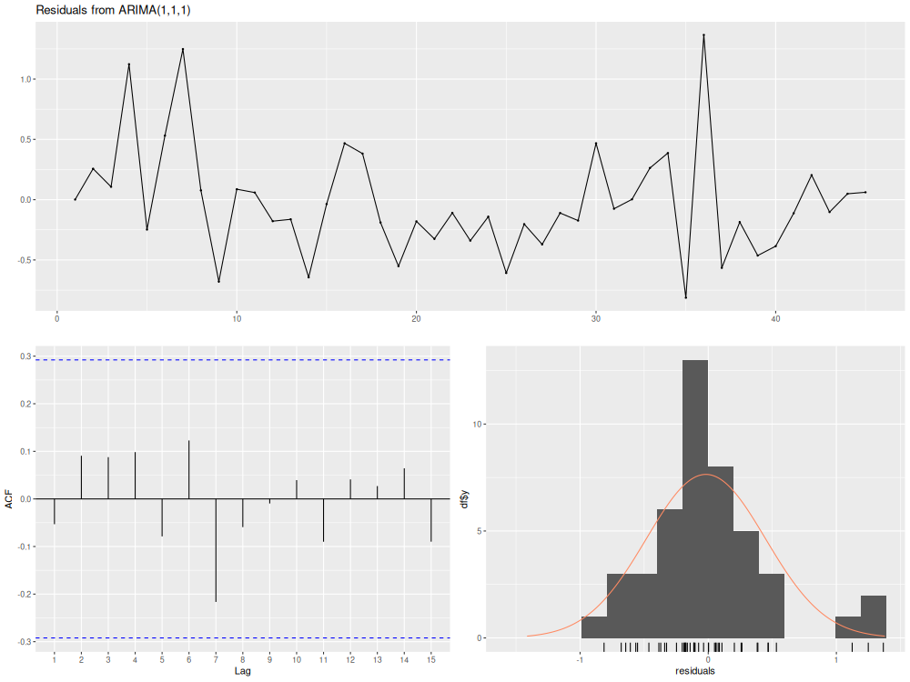
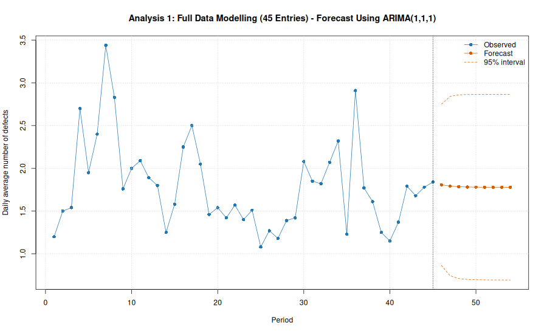
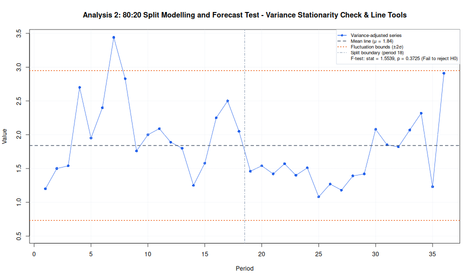
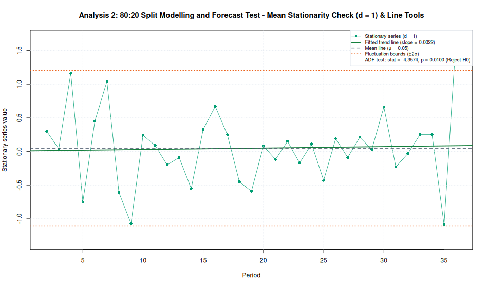
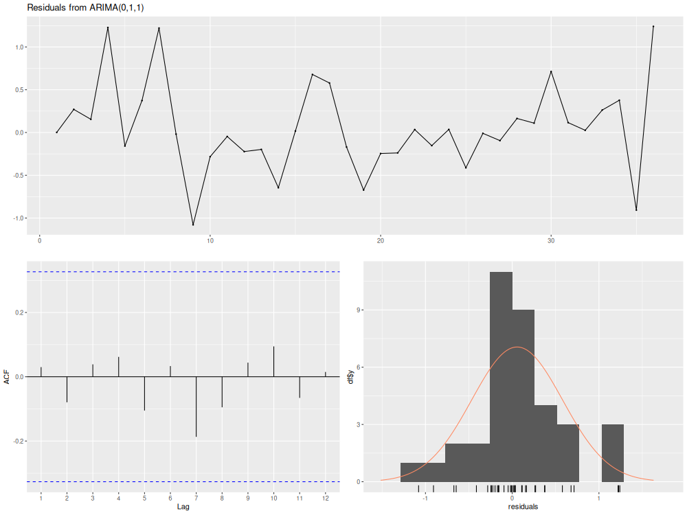

# Time Series Analysis of Truck Manufacturing Defects W1

- **Project root:** `/home/rstudio/project`
- **Data source:** `data/truck_manufacturing_defects_w1.csv`
- **Book comparison source:** `data/w1_book_acf_pacf.csv`
- **Total observations:** 45
- **80:20 split:** 36 modelling observations and 9 forecast test observations

## PDF Method Alignment

The workflow below follows the ARIMA Box-Jenkins notes in `docs/ARIMA_Box-Jenkins.pdf`:

- **Stationary in variance:** check from the time-series plot and variance behavior. The PDF notes that variance non-stationarity is not visible in the correlogram; use Box-Cox if variance is not stable.
- **Stationary in mean:** check the ACF/PACF pattern and the ADF test. ACF that dies down quickly and enters the +/- 2/sqrt(n) band supports stationarity in mean; ACF that starts near 1 and decays slowly suggests non-stationarity in mean.
- **ADF decision:** H0 means unit root / not stationary. Reject H0 when the ADF statistic is below the critical value or p-value < alpha. If H0 is not rejected, apply differencing and test again.
- **Model identification:** after the stationarity treatment, use ACF/PACF to form candidate ARIMA orders, then estimate parameters and compare candidate models.

## Analysis 1: Full Data Modelling (45 Entries)

- **Modelling observations:** 45, periods 1-45
- **Forecast type:** future forecast after the last observed period; no held-out accuracy metrics.

### 1. Time Series Plot



### 2. Stationarity Check Following the Box-Jenkins Flow

The diagram below evaluates stationarity before and after differencing using trend and variance line tools alongside ACF and PACF correlograms, aligned with the Box-Jenkins methodology in `docs/ARIMA_Box-Jenkins.pdf`.


#### A. Stationary in Variance?

- **H0:** variance in the first and second half is equal, so data is stationary in variance.
- **H1:** variance is different, so data is not stationary in variance.
- **Variance first half:** 0.3161
- **Variance second half:** 0.1869
- **F statistic:** 1.6911
- **p-value:** 0.2291
- **Alpha:** 0.05
- **Decision rule:** reject H0 if p-value < alpha.
- **Decision:** Fail to reject H0
- **Conclusion:** modelling series is stationary in variance.
- **Treatment:** No Box-Cox transformation needed.

**ACF/PACF note for variance:** ACF and PACF do not directly test stationarity in variance. They are used below for mean-stationarity and model-order diagnosis. Variance stationarity is decided here from the variance comparison and time-series plot.



#### B. Stationary in Mean?

Tested after the variance step using both ACF/PACF behavior and the ADF H0 mechanism.

**ACF/PACF decision before differencing:**

- **Significance threshold:** +/- 0.2981, calculated as +/- 2/sqrt(n).
- **ACF lag 1:** 0.4288
- **PACF lag 1:** 0.4288
- **Significant ACF lags:** 1
- **Significant PACF lags:** 1
- **ACF/PACF mean-stationarity decision:** stationary in mean
- **Reason:** ACF does not decay slowly from a value near 1; significant lags die out quickly.

**ADF decision:**

- **ADF test function:** `tseries::adf.test()`
- **H0:** gamma = 0, series has a unit root, so data is not stationary in mean.
- **H1:** gamma < 0, series has no unit root, so data is stationary in mean.
- **Initial ADF statistic before differencing:** -3.2768
- **Initial selected lag parameter:** 2
- **Initial ADF p-value:** 0.0875
- **Final ADF statistic:** -5.2165
- **Final selected lag parameter:** 2
- **Final ADF p-value:** 0.0100
- **Alpha:** 0.05
- **Decision rule:** reject H0 if p-value < alpha.
- **Decision:** Reject H0
- **Reason:** p-value (0.0100) < alpha (0.05).
- **Conclusion:** modelling series is stationary in mean at 5% significance level.
- **Treatment:** Differencing applied with d = 1.

**Alignment check:**

- **Initial ACF/PACF vs initial ADF:** not aligned.
- **Final ACF/PACF decision after treatment:** stationary in mean
- **Final ADF decision after treatment:** stationary in mean
- **Final ACF/PACF vs final ADF:** aligned.



#### C. Non-Stationarity Factor Diagnosis

- **Variance factor:** stationary, no Box-Cox needed.
- **Mean factor:** conflicting initial evidence: ACF/PACF indicates stationary in mean, while ADF indicates not stationary in mean; the computational workflow follows the ADF treatment path.
- **Final status:** series is ready for ACF/PACF identification.

#### D. Model Identification (ACF and PACF)


- **Significance threshold:** +/- 0.3015, calculated as +/- 2/sqrt(n).
- **Significant ACF lags:** 1
- **Significant PACF lags:** 1
- **Rule-based diagnosis:** Both ACF and PACF have significant lag(s); compare small AR/ARMA candidates with AIC.
- **p range from PACF:** 0..1
- **q range from ACF:** 0..1
- **Candidate from ACF/PACF:** ARIMA(p,1,q), p = 0..1, q = 0..1
- **Candidate estimation rule:** estimate the full p/q grid inside the ACF/PACF-derived range, then select by AIC and validate with residual diagnostics.

### 3. Parameter Estimation and Model Selection

Estimated on variance-adjusted series with `d = 1`.

**Candidate orders estimated:**

```text
  p d q
1 0 1 0
2 1 1 0
3 0 1 1
4 1 1 1
```

**Model comparison:**

```text
         model      aic log_likelihood
1 ARIMA(1,1,1) 66.42686      -30.21343
2 ARIMA(0,1,1) 67.78699      -31.89350
3 ARIMA(1,1,0) 69.90138      -32.95069
4 ARIMA(0,1,0) 73.51215      -35.75608
```

**Selected model by lowest AIC:** `ARIMA(1,1,1)`

**Selected model coefficients:**

```text
  parameter   estimate std_error   z_value      p_value
1       ar1  0.4649429 0.1395348  3.332094 8.619510e-04
2       ma1 -0.9999996 0.1276047 -7.836698 4.625504e-15
```

### 4. Diagnostic Checking IIDN



- **Mean residual:** -0.017998
- **Residual variance:** 0.216416
- **Independence test, Ljung-Box lag 7 p-value:** 0.6129
- **Normality test, Shapiro-Wilk p-value:** 0.0022
- **IIDN interpretation:** independent if Ljung-Box p-value > 0.05; normally distributed if Shapiro-Wilk p-value > 0.05; identically distributed is checked visually from residual plot and stable residual spread.

### 5. Forecasting



- **Forecast model:** `ARIMA(1,1,1)`
- **Forecast horizon:** 9 periods
- **Accuracy metrics:** not available because all observations are used for modelling.
- **Forecast CSV:** `data/truck_manufacturing_defects_w1_full_data_forecast.csv`

**Forecast values:**

```text
  period forecast  lower_95 upper_95
1     46 1.807188 0.8632768 2.751100
2     47 1.791933 0.7426822 2.841183
3     48 1.784840 0.7104178 2.859262
4     49 1.781542 0.7000198 2.863064
5     50 1.780009 0.6961528 2.863865
6     51 1.779296 0.6945622 2.864030
7     52 1.778964 0.6938674 2.864062
8     53 1.778810 0.6935539 2.864067
9     54 1.778739 0.6934103 2.864067
```

## Analysis 2: 80:20 Split Modelling and Forecast Test

- **Modelling observations:** 36, periods 1-36
- **Remaining forecast test observations:** 9, periods 37-45

### 1. Time Series Plot


### 2. Stationarity Check Following the Box-Jenkins Flow

The diagram below evaluates stationarity before and after differencing using trend and variance line tools alongside ACF and PACF correlograms, aligned with the Box-Jenkins methodology in `docs/ARIMA_Box-Jenkins.pdf`.


#### A. Stationary in Variance?

- **H0:** variance in the first and second half is equal, so data is stationary in variance.
- **H1:** variance is different, so data is not stationary in variance.
- **Variance first half:** 0.3329
- **Variance second half:** 0.2142
- **F statistic:** 1.5539
- **p-value:** 0.3725
- **Alpha:** 0.05
- **Decision rule:** reject H0 if p-value < alpha.
- **Decision:** Fail to reject H0
- **Conclusion:** modelling series is stationary in variance.
- **Treatment:** No Box-Cox transformation needed.

**ACF/PACF note for variance:** ACF and PACF do not directly test stationarity in variance. They are used below for mean-stationarity and model-order diagnosis. Variance stationarity is decided here from the variance comparison and time-series plot.



#### B. Stationary in Mean?

Tested after the variance step using both ACF/PACF behavior and the ADF H0 mechanism.

**ACF/PACF decision before differencing:**

- **Significance threshold:** +/- 0.3333, calculated as +/- 2/sqrt(n).
- **ACF lag 1:** 0.3985
- **PACF lag 1:** 0.3985
- **Significant ACF lags:** 1
- **Significant PACF lags:** 1
- **ACF/PACF mean-stationarity decision:** stationary in mean
- **Reason:** ACF does not decay slowly from a value near 1; significant lags die out quickly.

**ADF decision:**

- **ADF test function:** `tseries::adf.test()`
- **H0:** gamma = 0, series has a unit root, so data is not stationary in mean.
- **H1:** gamma < 0, series has no unit root, so data is stationary in mean.
- **Initial ADF statistic before differencing:** -2.3072
- **Initial selected lag parameter:** 2
- **Initial ADF p-value:** 0.4536
- **Final ADF statistic:** -4.3574
- **Final selected lag parameter:** 2
- **Final ADF p-value:** 0.0100
- **Alpha:** 0.05
- **Decision rule:** reject H0 if p-value < alpha.
- **Decision:** Reject H0
- **Reason:** p-value (0.0100) < alpha (0.05).
- **Conclusion:** modelling series is stationary in mean at 5% significance level.
- **Treatment:** Differencing applied with d = 1.

**Alignment check:**

- **Initial ACF/PACF vs initial ADF:** not aligned.
- **Final ACF/PACF decision after treatment:** stationary in mean
- **Final ADF decision after treatment:** stationary in mean
- **Final ACF/PACF vs final ADF:** aligned.



#### C. Non-Stationarity Factor Diagnosis

- **Variance factor:** stationary, no Box-Cox needed.
- **Mean factor:** conflicting initial evidence: ACF/PACF indicates stationary in mean, while ADF indicates not stationary in mean; the computational workflow follows the ADF treatment path.
- **Final status:** series is ready for ACF/PACF identification.

#### D. Model Identification (ACF and PACF)


- **Significance threshold:** +/- 0.3381, calculated as +/- 2/sqrt(n).
- **Significant ACF lags:** none
- **Significant PACF lags:** none
- **Rule-based diagnosis:** No strict significant ACF/PACF spikes, but low-order lags are visible inside the confidence band; estimate a small p/q range and compare.
- **p range from PACF:** 0..2
- **q range from ACF:** 0..1
- **Candidate from ACF/PACF:** ARIMA(p,1,q), p = 0..2, q = 0..1
- **Candidate estimation rule:** estimate the full p/q grid inside the ACF/PACF-derived range, then select by AIC and validate with residual diagnostics.

### 3. Parameter Estimation and Model Selection

Estimated on variance-adjusted series with `d = 1`.

**Candidate orders estimated:**

```text
  p d q
1 0 1 0
2 1 1 0
3 2 1 0
4 0 1 1
5 1 1 1
6 2 1 1
```

**Model comparison:**

```text
         model      aic log_likelihood
1 ARIMA(0,1,1) 58.83405      -27.41703
2 ARIMA(1,1,1) 59.38065      -26.69033
3 ARIMA(2,1,0) 60.53371      -27.26686
4 ARIMA(1,1,0) 60.80500      -28.40250
5 ARIMA(0,1,0) 61.97676      -29.98838
6 ARIMA(2,1,1) 62.38041      -27.19021
```

**Selected model by lowest AIC:** `ARIMA(0,1,1)`

**Selected model coefficients:**

```text
  parameter   estimate std_error  z_value     p_value
1       ma1 -0.4842679 0.1843573 -2.62679 0.008619462
```

### 4. Diagnostic Checking IIDN



- **Mean residual:** 0.056700
- **Residual variance:** 0.275057
- **Independence test, Ljung-Box lag 6 p-value:** 0.8453
- **Normality test, Shapiro-Wilk p-value:** 0.0560
- **IIDN interpretation:** independent if Ljung-Box p-value > 0.05; normally distributed if Shapiro-Wilk p-value > 0.05; identically distributed is checked visually from residual plot and stable residual spread.

### 5. Forecasting


- **Forecast model:** `ARIMA(0,1,1)`
- **Forecast horizon:** 9 periods
- **MAE:** 0.7270
- **RMSE:** 0.7669
- **MAPE:** 49.96%
- **Forecast CSV:** `data/truck_manufacturing_defects_w1_split_forecast.csv`

**Forecast values:**

```text
  period actual forecast  lower_95 upper_95      error absolute_error absolute_percentage_error
1     37   1.77 2.309222 1.2600248 3.358420 -0.5392223      0.5392223                  30.46454
2     38   1.61 2.309222 1.1287098 3.489735 -0.6992223      0.6992223                  43.42996
3     39   1.25 2.309222 1.0106060 3.607839 -1.0592223      1.0592223                  84.73778
4     40   1.15 2.309222 0.9023824 3.716062 -1.1592223      1.1592223                 100.80194
5     41   1.37 2.309222 0.8019091 3.816535 -0.9392223      0.9392223                  68.55637
6     42   1.79 2.309222 0.7077269 3.910718 -0.5192223      0.5192223                  29.00683
7     43   1.68 2.309222 0.6187839 3.999661 -0.6292223      0.6292223                  37.45371
8     44   1.78 2.309222 0.5342924 4.084152 -0.5292223      0.5292223                  29.73159
9     45   1.84 2.309222 0.4536440 4.164801 -0.4692223      0.4692223                  25.50121
```

## Comparison with the Original Book Analysis

The original W1 example in the book uses the same 45 daily observations and identifies the series from the time-series plot plus the raw ACF/PACF pattern.

### Book Reference Result

- The book describes W1 as having stationary constant mean and variance.
- The book's ACF decays gradually.
- The book's PACF has one main significant spike at lag 1.
- The book concludes that W1 is likely generated by an AR(1) process, i.e. `ARIMA(1,0,0)`.

Book ACF/PACF values and standard errors shown in the source are stored in `data/w1_book_acf_pacf.csv`.

The significance flags below use the rule `abs(estimate) > 2 * St.E.`.

```text
   lag book_acf book_acf_stderr book_pacf book_pacf_stderr book_acf_significant book_pacf_significant
1    1     0.43            0.15      0.43             0.15                 TRUE                  TRUE
2    2     0.26            0.15      0.09             0.15                FALSE                 FALSE
3    3     0.14            0.17      0.00             0.15                FALSE                 FALSE
4    4     0.08            0.18      0.00             0.15                FALSE                 FALSE
5    5    -0.09            0.19     -0.16             0.15                FALSE                 FALSE
6    6    -0.07            0.19      0.00             0.15                FALSE                 FALSE
7    7    -0.21            0.19     -0.18             0.15                FALSE                 FALSE
8    8    -0.11            0.19      0.07             0.15                FALSE                 FALSE
9    9    -0.05            0.19      0.05             0.15                FALSE                 FALSE
10  10    -0.01            0.19      0.01             0.15                FALSE                 FALSE
```

### Our Independent Analysis Result

- Our independent workflow applies formal variance testing and ADF testing with lag selection by AIC.
- Our full-data selected model is `ARIMA(1,1,1)`.
- Our 80:20 split selected model is `ARIMA(0,1,1)`.
- 80:20 split accuracy: MAE = 0.7270, RMSE = 0.7669, MAPE = 49.96%.

### Interpretation

The book's AR(1) conclusion is based on raw W1 ACF/PACF identification. Our independent procedure may select a different model because it first applies an ADF-based stationarity decision and then estimates candidates after any required treatment. This is the comparison point: the book gives the classical identification result, while our workflow documents what happens when the full Box-Jenkins decision path is applied computationally.

