# Time Series Analysis of Wolf Yearly Sunspot Numbers W2

- **Project root:** `/home/rstudio/project`
- **Data source:** `data/wolf_yearly_sunspot_numbers_w2.csv`
- **Plot output directory:** `plots_rstudio/w2`
- **Total observations:** 302
- **80:20 split:** 241 modelling observations and 61 forecast test observations

## PDF Method Alignment

The workflow below follows the ARIMA Box-Jenkins notes in `docs/ARIMA_Box-Jenkins.pdf`:

- **Stationary in variance:** check from the time-series plot and variance behavior. The PDF notes that variance non-stationarity is not visible in the correlogram; use Box-Cox if variance is not stable.
- **Stationary in mean:** check the ACF/PACF pattern and the ADF test. ACF that dies down quickly and enters the +/- 2/sqrt(n) band supports stationarity in mean; ACF that starts near 1 and decays slowly suggests non-stationarity in mean.
- **ADF decision:** H0 means unit root / not stationary. Reject H0 when the ADF statistic is below the critical value or p-value < alpha. If H0 is not rejected, apply differencing and test again.
- **Model identification:** after the stationarity treatment, use ACF/PACF to form candidate ARIMA orders, then estimate parameters and compare candidate models.

## Analysis 1: Full Data Modelling (302 Entries)

- **Modelling observations:** 302, periods 1700-2001
- **Forecast type:** future forecast after the last observed period; no held-out accuracy metrics.

### 1. Time Series Plot

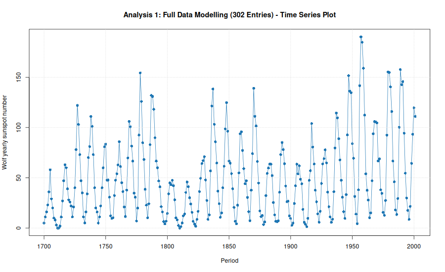

### 2. Stationarity Check Following the Box-Jenkins Flow

The diagram below evaluates stationarity before and after differencing using trend and variance line tools alongside ACF and PACF correlograms, aligned with the Box-Jenkins methodology in `docs/ARIMA_Box-Jenkins.pdf`.

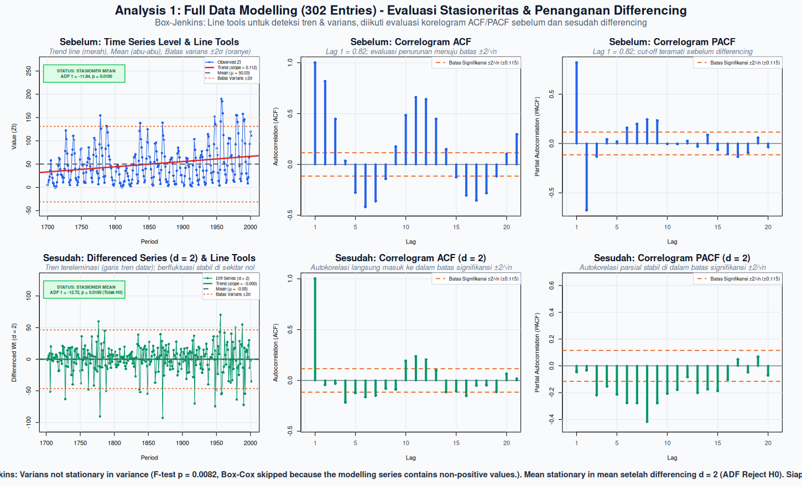

#### A. Stationary in Variance?

- **H0:** variance in the first and second half is equal, so data is stationary in variance.
- **H1:** variance is different, so data is not stationary in variance.
- **Variance first half:** 1268.5522
- **Variance second half:** 1958.1673
- **F statistic:** 0.6478
- **p-value:** 0.0082
- **Alpha:** 0.05
- **Decision rule:** reject H0 if p-value < alpha.
- **Decision:** Reject H0
- **Conclusion:** modelling series is not stationary in variance.
- **Treatment:** Box-Cox skipped because the modelling series contains non-positive values.

**ACF/PACF note for variance:** ACF and PACF do not directly test stationarity in variance. They are used below for mean-stationarity and model-order diagnosis. Variance stationarity is decided here from the variance comparison and time-series plot.

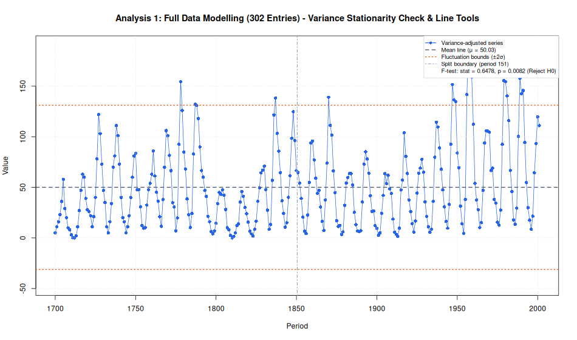

#### B. Stationary in Mean?

Tested after the variance step using both ACF/PACF behavior and the ADF H0 mechanism.

**ACF/PACF decision before differencing:**

- **Significance threshold:** +/- 0.1151, calculated as +/- 2/sqrt(n).
- **ACF lag 1:** 0.8181
- **PACF lag 1:** 0.8181
- **Significant ACF lags:** 1, 2, 4, 5, 6, 7, 8, 9, 10, 11, 12, 13, 14, 15, 16, 17, 18, 20
- **Significant PACF lags:** 1, 2, 3, 6, 7, 8, 9, 17
- **ACF/PACF mean-stationarity decision:** not stationary in mean
- **Reason:** ACF starts near 1 or remains significant for many lags, indicating slow decay.

**ADF decision:**

- **ADF test function:** `tseries::adf.test()`
- **H0:** gamma = 0, series has a unit root, so data is not stationary in mean.
- **H1:** gamma < 0, series has no unit root, so data is stationary in mean.
- **Initial ADF statistic before differencing:** -11.8437
- **Initial selected lag parameter:** 2
- **Initial ADF p-value:** 0.0100

**ADF lag sensitivity before differencing:**

Several ADF lag parameters are tested because the unit-root decision can change when lagged differences are added to absorb autocorrelation.

```text
   lag_k adf_statistic    p_value          decision             conclusion
1      0     -5.514201 0.01000000         Reject H0     stationary in mean
2      1    -12.516865 0.01000000         Reject H0     stationary in mean
3      2    -11.843719 0.01000000         Reject H0     stationary in mean
4      3     -9.546310 0.01000000         Reject H0     stationary in mean
5      4     -8.545871 0.01000000         Reject H0     stationary in mean
6      5     -6.586686 0.01000000         Reject H0     stationary in mean
7      6     -5.015926 0.01000000         Reject H0     stationary in mean
8      7     -3.834503 0.01767287         Reject H0     stationary in mean
9      8     -2.941860 0.17930209 Fail to reject H0 not stationary in mean
10     9     -2.928990 0.18472668 Fail to reject H0 not stationary in mean
11    10     -2.902272 0.19598836 Fail to reject H0 not stationary in mean
```

- **Final ADF statistic:** -12.7172
- **Final selected lag parameter:** 2
- **Final ADF p-value:** 0.0100

**ADF lag sensitivity after treatment:**

```text
   lag_k adf_statistic p_value  decision         conclusion
1      0     -17.91296    0.01 Reject H0 stationary in mean
2      1     -12.74035    0.01 Reject H0 stationary in mean
3      2     -12.71715    0.01 Reject H0 stationary in mean
4      3     -11.86890    0.01 Reject H0 stationary in mean
5      4     -12.11617    0.01 Reject H0 stationary in mean
6      5     -13.03932    0.01 Reject H0 stationary in mean
7      6     -13.73174    0.01 Reject H0 stationary in mean
8      7     -16.70805    0.01 Reject H0 stationary in mean
9      8     -15.95542    0.01 Reject H0 stationary in mean
10     9     -14.43252    0.01 Reject H0 stationary in mean
11    10     -13.32944    0.01 Reject H0 stationary in mean
```

- **Alpha:** 0.05
- **Decision rule:** reject H0 if p-value < alpha.
- **Decision:** Reject H0
- **Reason:** p-value (0.0100) < alpha (0.05).
- **Conclusion:** modelling series is stationary in mean at 5% significance level.
- **Treatment:** Differencing applied with d = 2. Series is still not stationary in mean after d = 2.

**Alignment check:**

- **Initial ACF/PACF vs initial ADF:** not aligned.
- **Final ACF/PACF decision after treatment:** not stationary in mean
- **Final ADF decision after treatment:** stationary in mean
- **Final ACF/PACF vs final ADF:** not aligned.

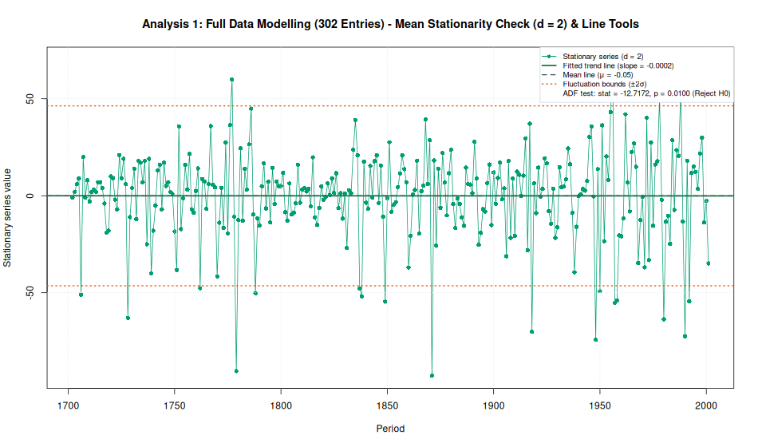

#### C. Non-Stationarity Factor Diagnosis

- **Variance factor:** not stationary, handled by Box-Cox check.
- **Mean factor:** conflicting initial evidence: ACF/PACF indicates not stationary in mean, while ADF indicates stationary in mean; the computational workflow follows the ADF treatment path.
- **Final status:** series is ready for ACF/PACF identification.

#### D. Model Identification (ACF and PACF)

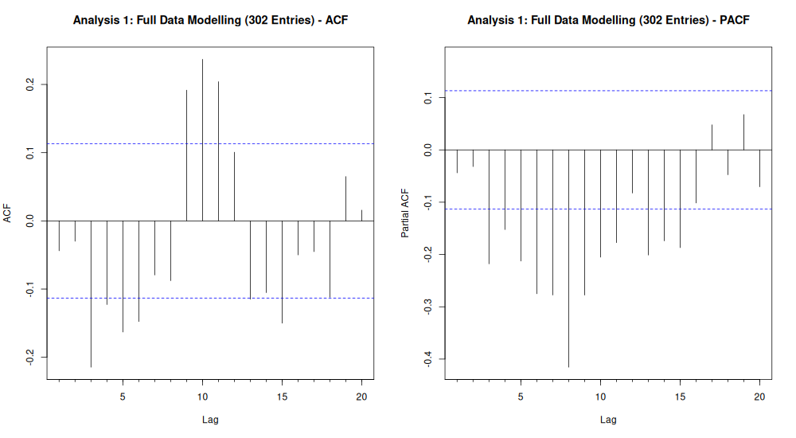

- **Significance threshold:** +/- 0.1155, calculated as +/- 2/sqrt(n).
- **Significant ACF lags:** 3, 4, 5, 6, 9, 10, 11, 15
- **Significant PACF lags:** 3, 4, 5, 6, 7, 8, 9, 10, 11, 13, 14, 15
- **Rule-based diagnosis:** Both ACF and PACF have significant lag(s); compare small AR/ARMA candidates with AIC.
- **p range from PACF:** 0..0
- **q range from ACF:** 0..0
- **Candidate from ACF/PACF:** ARIMA(p,2,q), p = 0..0, q = 0..0
- **Candidate estimation rule:** estimate the full p/q grid inside the ACF/PACF-derived range, then select by AIC and validate with residual diagnostics.

### 3. Parameter Estimation and Model Selection

Estimated on variance-adjusted series with `d = 2`.

**Candidate orders estimated:**

```text
  p d q
1 0 2 0
```

**AR(p) lag possibilities:**

The table below estimates pure autoregressive alternatives `ARIMA(p,d,0)` for several lag lengths, using the same differencing order selected in the stationarity step.

```text
           model ar_lags      aic log_likelihood
1  ARIMA(12,2,0)   1..12 2564.095      -1269.047
2  ARIMA(11,2,0)   1..11 2564.824      -1270.412
3  ARIMA(10,2,0)   1..10 2574.875      -1276.437
4   ARIMA(9,2,0)    1..9 2587.564      -1283.782
5   ARIMA(8,2,0)    1..8 2611.925      -1296.962
6   ARIMA(7,2,0)    1..7 2668.287      -1326.144
7   ARIMA(6,2,0)    1..6 2690.360      -1338.180
8   ARIMA(5,2,0)    1..5 2711.981      -1349.990
9   ARIMA(4,2,0)    1..4 2724.017      -1357.008
10  ARIMA(3,2,0)    1..3 2729.049      -1360.525
11  ARIMA(0,2,0)    none 2738.551      -1368.276
12  ARIMA(1,2,0)    1..1 2739.972      -1367.986
13  ARIMA(2,2,0)    1..2 2741.666      -1367.833
```

**Combined model comparison for final decision:**

This table combines the ACF/PACF candidate grid with the extra AR(p) lag possibilities, then evaluates IIDN for every fitted model.

```text
   fit_index         model      aic log_likelihood  ljung_box_p    shapiro_p   iidn_score mean_residual
1         13 ARIMA(12,2,0) 2564.095      -1269.047 2.638366e-02 1.426975e-03 1.426975e-03  -0.127875893
2         12 ARIMA(11,2,0) 2564.824      -1270.412 6.326861e-03 5.233331e-04 5.233331e-04  -0.125143678
3         11 ARIMA(10,2,0) 2574.875      -1276.437 2.687613e-03 5.085359e-04 5.085359e-04  -0.093596015
4         10  ARIMA(9,2,0) 2587.564      -1283.782 6.739720e-07 2.890073e-03 6.739720e-07  -0.082409039
5          9  ARIMA(8,2,0) 2611.925      -1296.962 7.999541e-06 5.736564e-03 7.999541e-06  -0.044337888
6          8  ARIMA(7,2,0) 2668.287      -1326.144 5.131451e-13 3.198801e-04 5.131451e-13  -0.015583960
7          7  ARIMA(6,2,0) 2690.360      -1338.180 6.470380e-13 3.066678e-05 6.470380e-13  -0.010421076
8          6  ARIMA(5,2,0) 2711.981      -1349.990 1.034506e-12 1.303503e-05 1.034506e-12  -0.013060096
9          5  ARIMA(4,2,0) 2724.017      -1357.008 2.597922e-14 2.125400e-06 2.597922e-14  -0.009728431
10         4  ARIMA(3,2,0) 2729.049      -1360.525 6.106227e-15 3.456905e-07 6.106227e-15  -0.015512552
11         1  ARIMA(0,2,0) 2738.551      -1368.276 1.033845e-10 4.095566e-09 1.033845e-10  -0.048314754
12         2  ARIMA(1,2,0) 2739.972      -1367.986 8.076873e-13 4.216176e-09 8.076873e-13  -0.045352630
13         3  ARIMA(2,2,0) 2741.666      -1367.833 4.019007e-14 1.010424e-08 4.019007e-14  -0.042821714
   variance_residual iidn_pass    iidn_decision selection_group
1           271.0641     FALSE Fail IIDN checks       IIDN fail
2           273.6445     FALSE Fail IIDN checks       IIDN fail
3           285.3230     FALSE Fail IIDN checks       IIDN fail
4           300.1446     FALSE Fail IIDN checks       IIDN fail
5           328.6199     FALSE Fail IIDN checks       IIDN fail
6           401.2936     FALSE Fail IIDN checks       IIDN fail
7           435.6375     FALSE Fail IIDN checks       IIDN fail
8           472.0701     FALSE Fail IIDN checks       IIDN fail
9           495.0732     FALSE Fail IIDN checks       IIDN fail
10          506.9730     FALSE Fail IIDN checks       IIDN fail
11          534.1242     FALSE Fail IIDN checks       IIDN fail
12          533.0905     FALSE Fail IIDN checks       IIDN fail
13          532.5442     FALSE Fail IIDN checks       IIDN fail
                                                                                     residual_plot
1  plots_rstudio/w2/full_data_candidate_model_diagnostics/1_ARIMA_12_2_0__residual_diagnostics.png
2  plots_rstudio/w2/full_data_candidate_model_diagnostics/2_ARIMA_11_2_0__residual_diagnostics.png
3  plots_rstudio/w2/full_data_candidate_model_diagnostics/3_ARIMA_10_2_0__residual_diagnostics.png
4   plots_rstudio/w2/full_data_candidate_model_diagnostics/4_ARIMA_9_2_0__residual_diagnostics.png
5   plots_rstudio/w2/full_data_candidate_model_diagnostics/5_ARIMA_8_2_0__residual_diagnostics.png
6   plots_rstudio/w2/full_data_candidate_model_diagnostics/6_ARIMA_7_2_0__residual_diagnostics.png
7   plots_rstudio/w2/full_data_candidate_model_diagnostics/7_ARIMA_6_2_0__residual_diagnostics.png
8   plots_rstudio/w2/full_data_candidate_model_diagnostics/8_ARIMA_5_2_0__residual_diagnostics.png
9   plots_rstudio/w2/full_data_candidate_model_diagnostics/9_ARIMA_4_2_0__residual_diagnostics.png
10 plots_rstudio/w2/full_data_candidate_model_diagnostics/10_ARIMA_3_2_0__residual_diagnostics.png
11 plots_rstudio/w2/full_data_candidate_model_diagnostics/11_ARIMA_0_2_0__residual_diagnostics.png
12 plots_rstudio/w2/full_data_candidate_model_diagnostics/12_ARIMA_1_2_0__residual_diagnostics.png
13 plots_rstudio/w2/full_data_candidate_model_diagnostics/13_ARIMA_2_2_0__residual_diagnostics.png
```

**Model comparison plot:**

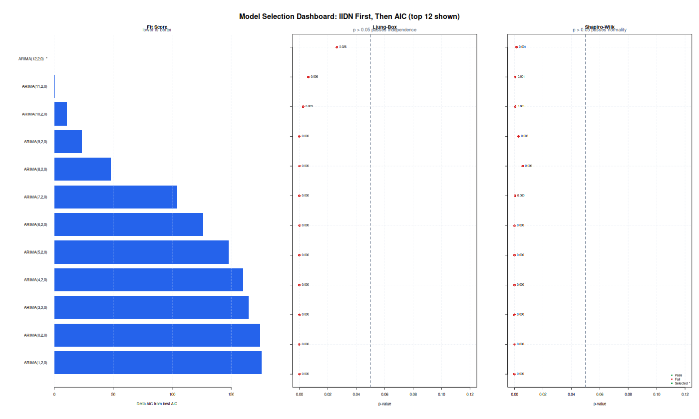

**Selected decision model:** `ARIMA(12,2,0)`

- **Selection rule:** evaluate IIDN for every candidate model first, then choose the lowest AIC among models that pass IIDN checks. If no candidate passes IIDN, choose the lowest-AIC fallback and document the diagnostic risk.
- **Selection result:** No candidate passed all IIDN checks, so the lowest-AIC candidate is selected as the fallback model.

**Final ARIMA model equation:**

General ARIMA form:

$$
\phi(B) (1 - B)^d Z_t = \theta_0 + \theta(B) a_t
$$

B: operator backshift (`BZ_t = Z_{t-1}`) - `a_t`: galat white noise - `theta_0`: konstanta.

Estimated model form:

$$
(1 + 0.6275B^{1} + 0.6972B^{2} + 0.8857B^{3} + 0.8537B^{4} + 0.8910B^{5} + 0.8908B^{6} + 0.8346B^{7} + 0.8541B^{8} + 0.6007B^{9} + 0.3970B^{10} + 0.2576B^{11} + 0.0972B^{12})(1 - B)^{2} Z_t = (1)a_t
$$

- **Decision model:** select `ARIMA(12,2,0)`. No candidate passed all IIDN checks, so the lowest-AIC candidate is selected as the fallback model.
- **Equation note:** MA signs follow the R forecast::Arima convention, so MA terms appear as plus/minus the estimated ma coefficient on the right side.

**Selected model coefficients:**

```text
   parameter    estimate  std_error    z_value      p_value
1        ar1 -0.62753241 0.05753648 -10.906687 1.070883e-27
2        ar2 -0.69717518 0.06643412 -10.494234 9.181948e-26
3        ar3 -0.88572299 0.07437723 -11.908523 1.068530e-32
4        ar4 -0.85368032 0.08350168 -10.223511 1.556003e-24
5        ar5 -0.89098180 0.08396906 -10.610834 2.653700e-26
6        ar6 -0.89082830 0.08564883 -10.400940 2.454995e-25
7        ar7 -0.83464889 0.08551799  -9.759921 1.672850e-22
8        ar8 -0.85408315 0.08344741 -10.234987 1.382139e-24
9        ar9 -0.60065888 0.08367276  -7.178667 7.039449e-13
10      ar10 -0.39703209 0.07475462  -5.311137 1.089431e-07
11      ar11 -0.25762665 0.06639519  -3.880200 1.043705e-04
12      ar12 -0.09715226 0.05865693  -1.656279 9.766527e-02
```

### 4. Diagnostic Checking IIDN

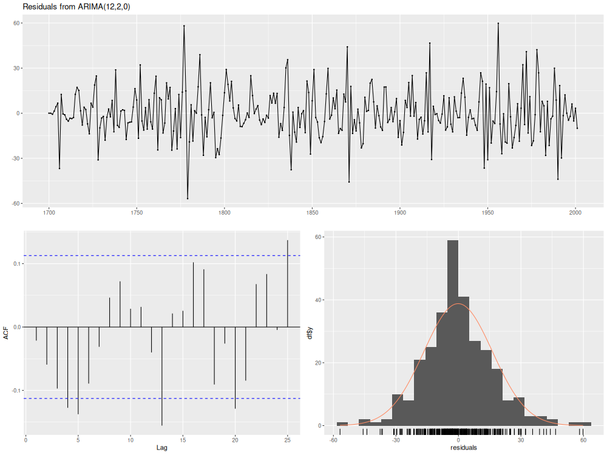

- **Mean residual:** -0.127876
- **Residual variance:** 271.064121
- **Independence test, Ljung-Box lag 3 p-value:** 0.0000
- **Normality test, Shapiro-Wilk p-value:** 0.0014
- **IIDN interpretation:** independent if Ljung-Box p-value > 0.05; normally distributed if Shapiro-Wilk p-value > 0.05; identically distributed is checked visually from residual plot and stable residual spread.

### 5. Forecasting

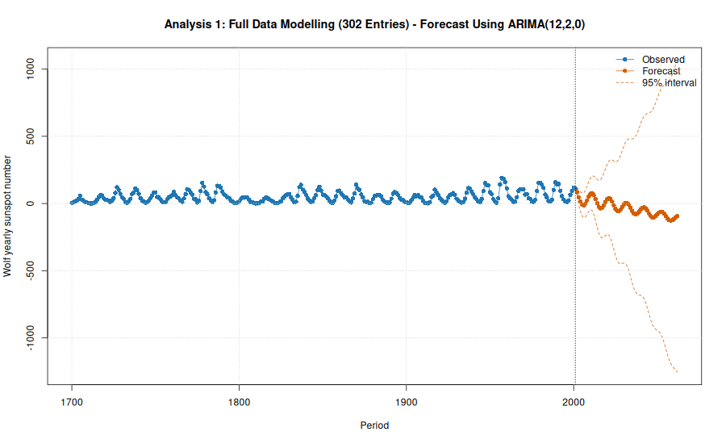

- **Forecast model:** `ARIMA(12,2,0)`
- **Forecast horizon:** 61 periods
- **Accuracy metrics:** not available because all observations are used for modelling.
- **Forecast CSV:** `data/wolf_yearly_sunspot_numbers_w2_full_data_forecast.csv`

**Forecast values:**

```text
   period    forecast     lower_95   upper_95
1    2002   84.243780    51.253027  117.23453
2    2003   46.524962    -9.497838  102.54776
3    2004   14.972391   -58.514493   88.45928
4    2005   -7.794839   -92.107155   76.51748
5    2006  -14.793175  -107.106777   77.52043
6    2007   -1.319954  -100.176837   97.53693
7    2008   23.105997   -81.963299  128.17529
8    2009   51.432965   -60.333510  163.19944
9    2010   72.103796   -46.474021  190.68161
10   2011   76.820857   -51.204940  204.84665
11   2012   62.242285   -79.334411  203.81898
12   2013   34.402521  -124.318694  193.12374
13   2014    2.079273  -175.340437  179.49898
14   2015  -24.238154  -219.925574  171.44927
15   2016  -35.975892  -247.647556  175.69577
16   2017  -30.918225  -256.023919  194.18747
17   2018  -12.695265  -249.663110  224.27258
18   2019   11.294488  -237.037031  259.62601
19   2020   31.909274  -228.439400  292.25795
20   2021   40.868375  -233.235079  314.97183
21   2022   34.492488  -255.732648  324.71762
22   2023   14.421073  -294.243348  323.08549
23   2024  -13.032899  -341.821726  315.75593
24   2025  -38.934876  -388.286504  310.41675
25   2026  -55.096799  -424.134718  313.94112
26   2027  -57.200190  -444.352347  329.95197
27   2028  -45.948682  -449.706361  357.80900
28   2029  -26.584459  -446.061845  392.89293
29   2030   -7.090343  -442.340918  428.16023
30   2031    4.782238  -447.243704  456.80818
31   2032    4.213446  -466.251754  474.67865
32   2033   -9.197878  -499.968472  481.57272
33   2034  -31.397502  -543.991315  481.19631
34   2035  -55.333447  -590.459857  479.79296
35   2036  -73.553553  -630.984438  483.87733
36   2037  -80.828934  -659.645686  497.98782
37   2038  -75.884591  -674.939472  523.17029
38   2039  -61.760414  -680.166479  556.64565
39   2040  -44.629933  -682.117829  592.85796
40   2041  -31.517371  -688.562494  625.52775
41   2042  -27.825612  -705.541108  649.88988
42   2043  -35.522028  -735.353588  664.30953
43   2044  -52.543791  -775.841763  670.75418
44   2045  -73.635018  -821.254342  673.98431
45   2046  -92.281101  -864.377148  679.81495
46   2047 -103.008594  -899.103899  693.08671
47   2048 -103.260307  -922.534853  716.01424
48   2049  -94.211816  -935.887097  747.46347
49   2050  -80.251973  -943.923208  783.41926
50   2051  -67.352577  -953.171499  818.46635
51   2052  -60.940665  -969.613390  847.73206
52   2053  -64.020614  -996.627825  868.58660
53   2054  -76.194723 -1033.884559  881.49511
54   2055  -93.904753 -1077.560429  889.75092
55   2056 -111.767909 -1121.775746  898.23993
56   2057 -124.505923 -1160.714151  911.70231
57   2058 -128.782930 -1190.659373  933.09351
58   2059 -124.312926 -1211.226045  962.60019
59   2060 -113.869256 -1225.378958  997.64045
60   2061 -102.227573 -1238.289052 1033.83391
61   2062  -94.441917 -1255.468766 1066.58493
```

## Analysis 2: 80:20 Split Modelling and Forecast Test

- **Modelling observations:** 241, periods 1700-1940
- **Remaining forecast test observations:** 61, periods 1941-2001

### 1. Time Series Plot

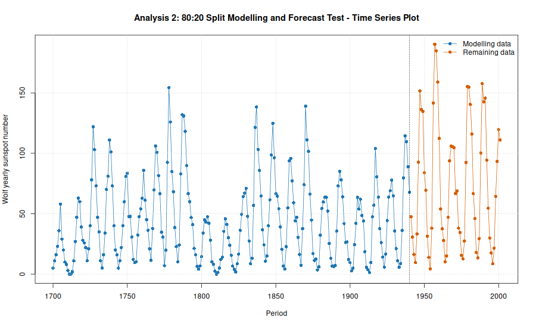

### 2. Stationarity Check Following the Box-Jenkins Flow

The diagram below evaluates stationarity before and after differencing using trend and variance line tools alongside ACF and PACF correlograms, aligned with the Box-Jenkins methodology in `docs/ARIMA_Box-Jenkins.pdf`.

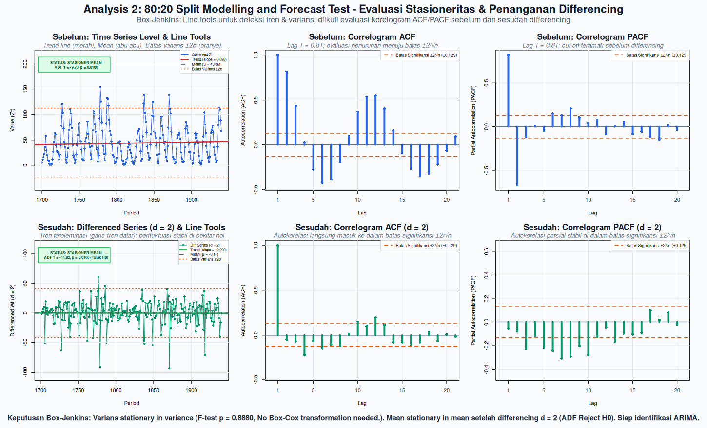

#### A. Stationary in Variance?

- **H0:** variance in the first and second half is equal, so data is stationary in variance.
- **H1:** variance is different, so data is not stationary in variance.
- **Variance first half:** 1191.8661
- **Variance second half:** 1161.5484
- **F statistic:** 1.0261
- **p-value:** 0.8880
- **Alpha:** 0.05
- **Decision rule:** reject H0 if p-value < alpha.
- **Decision:** Fail to reject H0
- **Conclusion:** modelling series is stationary in variance.
- **Treatment:** No Box-Cox transformation needed.

**ACF/PACF note for variance:** ACF and PACF do not directly test stationarity in variance. They are used below for mean-stationarity and model-order diagnosis. Variance stationarity is decided here from the variance comparison and time-series plot.

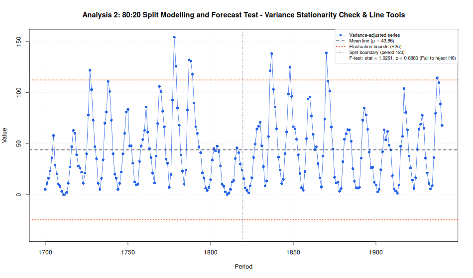

#### B. Stationary in Mean?

Tested after the variance step using both ACF/PACF behavior and the ADF H0 mechanism.

**ACF/PACF decision before differencing:**

- **Significance threshold:** +/- 0.1288, calculated as +/- 2/sqrt(n).
- **ACF lag 1:** 0.8130
- **PACF lag 1:** 0.8130
- **Significant ACF lags:** 1, 2, 4, 5, 6, 7, 9, 10, 11, 12, 13, 15, 16, 17, 18
- **Significant PACF lags:** 1, 2, 6, 7, 8, 18
- **ACF/PACF mean-stationarity decision:** not stationary in mean
- **Reason:** ACF starts near 1 or remains significant for many lags, indicating slow decay.

**ADF decision:**

- **ADF test function:** `tseries::adf.test()`
- **H0:** gamma = 0, series has a unit root, so data is not stationary in mean.
- **H1:** gamma < 0, series has no unit root, so data is stationary in mean.
- **Initial ADF statistic before differencing:** -9.6987
- **Initial selected lag parameter:** 2
- **Initial ADF p-value:** 0.0100

**ADF lag sensitivity before differencing:**

Several ADF lag parameters are tested because the unit-root decision can change when lagged differences are added to absorb autocorrelation.

```text
   lag_k adf_statistic    p_value          decision             conclusion
1      0     -4.946084 0.01000000         Reject H0     stationary in mean
2      1    -10.578803 0.01000000         Reject H0     stationary in mean
3      2     -9.698695 0.01000000         Reject H0     stationary in mean
4      3     -8.066891 0.01000000         Reject H0     stationary in mean
5      4     -7.496353 0.01000000         Reject H0     stationary in mean
6      5     -5.673321 0.01000000         Reject H0     stationary in mean
7      6     -4.639445 0.01000000         Reject H0     stationary in mean
8      7     -3.598198 0.03403718         Reject H0     stationary in mean
9      8     -3.164615 0.09445312 Fail to reject H0 not stationary in mean
10     9     -2.977735 0.16460506 Fail to reject H0 not stationary in mean
11    10     -2.754460 0.25851670 Fail to reject H0 not stationary in mean
```

- **Final ADF statistic:** -11.8216
- **Final selected lag parameter:** 2
- **Final ADF p-value:** 0.0100

**ADF lag sensitivity after treatment:**

```text
   lag_k adf_statistic p_value  decision         conclusion
1      0     -16.16137    0.01 Reject H0 stationary in mean
2      1     -11.94291    0.01 Reject H0 stationary in mean
3      2     -11.82155    0.01 Reject H0 stationary in mean
4      3     -10.39841    0.01 Reject H0 stationary in mean
5      4     -10.71631    0.01 Reject H0 stationary in mean
6      5     -11.14142    0.01 Reject H0 stationary in mean
7      6     -12.39741    0.01 Reject H0 stationary in mean
8      7     -13.04962    0.01 Reject H0 stationary in mean
9      8     -12.25961    0.01 Reject H0 stationary in mean
10     9     -12.98824    0.01 Reject H0 stationary in mean
11    10     -11.48520    0.01 Reject H0 stationary in mean
```

- **Alpha:** 0.05
- **Decision rule:** reject H0 if p-value < alpha.
- **Decision:** Reject H0
- **Reason:** p-value (0.0100) < alpha (0.05).
- **Conclusion:** modelling series is stationary in mean at 5% significance level.
- **Treatment:** Differencing applied with d = 2.

**Alignment check:**

- **Initial ACF/PACF vs initial ADF:** not aligned.
- **Final ACF/PACF decision after treatment:** stationary in mean
- **Final ADF decision after treatment:** stationary in mean
- **Final ACF/PACF vs final ADF:** aligned.

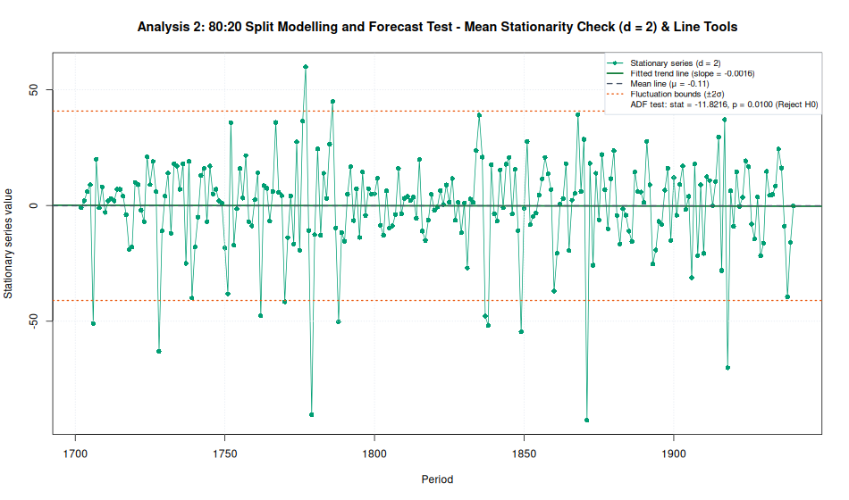

#### C. Non-Stationarity Factor Diagnosis

- **Variance factor:** stationary, no Box-Cox needed.
- **Mean factor:** conflicting initial evidence: ACF/PACF indicates not stationary in mean, while ADF indicates stationary in mean; the computational workflow follows the ADF treatment path.
- **Final status:** series is ready for ACF/PACF identification.

#### D. Model Identification (ACF and PACF)

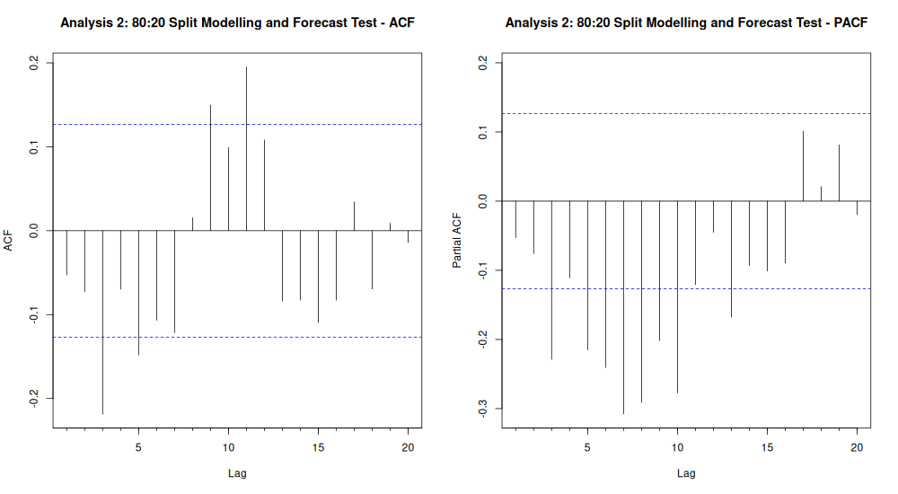

- **Significance threshold:** +/- 0.1294, calculated as +/- 2/sqrt(n).
- **Significant ACF lags:** 3, 5, 9, 11
- **Significant PACF lags:** 3, 5, 6, 7, 8, 9, 10, 13
- **Rule-based diagnosis:** Both ACF and PACF have significant lag(s); compare small AR/ARMA candidates with AIC.
- **p range from PACF:** 0..2
- **q range from ACF:** 0..2
- **Candidate from ACF/PACF:** ARIMA(p,2,q), p = 0..2, q = 0..2
- **Candidate estimation rule:** estimate the full p/q grid inside the ACF/PACF-derived range, then select by AIC and validate with residual diagnostics.

### 3. Parameter Estimation and Model Selection

Estimated on variance-adjusted series with `d = 2`.

**Candidate orders estimated:**

```text
  p d q
1 0 2 0
2 1 2 0
3 2 2 0
4 0 2 1
5 1 2 1
6 2 2 1
7 0 2 2
8 1 2 2
9 2 2 2
```

**AR(p) lag possibilities:**

The table below estimates pure autoregressive alternatives `ARIMA(p,d,0)` for several lag lengths, using the same differencing order selected in the stationarity step.

```text
           model ar_lags      aic log_likelihood
1  ARIMA(12,2,0)   1..12 2009.757      -991.8785
2  ARIMA(11,2,0)   1..11 2009.766      -992.8832
3  ARIMA(10,2,0)   1..10 2014.241      -996.1207
4   ARIMA(9,2,0)    1..9 2035.737     -1007.8685
5   ARIMA(8,2,0)    1..8 2045.540     -1013.7700
6   ARIMA(7,2,0)    1..7 2066.499     -1025.2493
7   ARIMA(6,2,0)    1..6 2089.447     -1037.7235
8   ARIMA(5,2,0)    1..5 2102.104     -1045.0518
9   ARIMA(4,2,0)    1..4 2111.841     -1050.9205
10  ARIMA(3,2,0)    1..3 2113.019     -1052.5094
11  ARIMA(0,2,0)    none 2122.047     -1060.0234
12  ARIMA(1,2,0)    1..1 2123.385     -1059.6923
13  ARIMA(2,2,0)    1..2 2124.016     -1059.0080
```

**Combined model comparison for final decision:**

This table combines the ACF/PACF candidate grid with the extra AR(p) lag possibilities, then evaluates IIDN for every fitted model.

```text
   fit_index         model      aic log_likelihood  ljung_box_p    shapiro_p   iidn_score mean_residual
1          9  ARIMA(2,2,2) 1987.145      -988.5726 3.018465e-02 6.224570e-04 6.224570e-04  -0.902320642
2         19 ARIMA(12,2,0) 2009.757      -991.8785 1.173976e-01 2.152227e-03 2.152227e-03   0.015627657
3         18 ARIMA(11,2,0) 2009.766      -992.8832 5.721305e-02 1.103593e-03 1.103593e-03   0.006058353
4         17 ARIMA(10,2,0) 2014.241      -996.1207 3.814941e-02 5.012293e-04 5.012293e-04  -0.003644977
5         16  ARIMA(9,2,0) 2035.737     -1007.8685 9.454621e-06 1.718362e-03 9.454621e-06  -0.010431827
6         15  ARIMA(8,2,0) 2045.540     -1013.7700 2.686992e-04 7.593336e-04 2.686992e-04  -0.022505149
7          6  ARIMA(2,2,1) 2052.031     -1022.0154 1.263772e-10 3.697030e-03 1.263772e-10  -0.273570316
8          8  ARIMA(1,2,2) 2059.732     -1025.8659 5.046297e-12 1.139295e-03 5.046297e-12  -0.275603394
9          5  ARIMA(1,2,1) 2064.866     -1029.4328 8.260059e-14 4.995068e-04 8.260059e-14  -0.280386065
10        14  ARIMA(7,2,0) 2066.499     -1025.2493 1.221273e-05 1.765329e-03 1.221273e-05  -0.037570075
11         7  ARIMA(0,2,2) 2070.761     -1032.3807 0.000000e+00 2.756238e-02 0.000000e+00  -0.320675280
12        13  ARIMA(6,2,0) 2089.447     -1037.7235 2.938775e-07 5.118593e-06 2.938775e-07  -0.050868348
13        12  ARIMA(5,2,0) 2102.104     -1045.0518 1.910752e-07 2.437326e-05 1.910752e-07  -0.062175249
14        11  ARIMA(4,2,0) 2111.841     -1050.9205 6.003741e-09 1.390455e-06 6.003741e-09  -0.083108903
15        10  ARIMA(3,2,0) 2113.019     -1052.5094 1.763419e-08 6.049550e-07 1.763419e-08  -0.097584926
16         1  ARIMA(0,2,0) 2122.047     -1060.0234 1.190163e-04 6.273334e-10 6.273334e-10  -0.111996082
17         4  ARIMA(0,2,1) 2123.242     -1059.6209 3.296601e-06 8.356473e-10 8.356473e-10  -0.119366054
18         2  ARIMA(1,2,0) 2123.385     -1059.6923 6.769164e-06 7.306503e-10 7.306503e-10  -0.117827644
19         3  ARIMA(2,2,0) 2124.016     -1059.0080 2.047503e-07 3.563561e-09 3.563561e-09  -0.121642455
   variance_residual iidn_pass    iidn_decision selection_group
1           218.0378     FALSE Fail IIDN checks       IIDN fail
2           230.5414     FALSE Fail IIDN checks       IIDN fail
3           232.5873     FALSE Fail IIDN checks       IIDN fail
4           239.2783     FALSE Fail IIDN checks       IIDN fail
5           265.1051     FALSE Fail IIDN checks       IIDN fail
6           279.0472     FALSE Fail IIDN checks       IIDN fail
7           295.7894     FALSE Fail IIDN checks       IIDN fail
8           305.9647     FALSE Fail IIDN checks       IIDN fail
9           315.4756     FALSE Fail IIDN checks       IIDN fail
10          308.1853     FALSE Fail IIDN checks       IIDN fail
11          322.4798     FALSE Fail IIDN checks       IIDN fail
12          343.1624     FALSE Fail IIDN checks       IIDN fail
13          365.4394     FALSE Fail IIDN checks       IIDN fail
14          384.2378     FALSE Fail IIDN checks       IIDN fail
15          389.4690     FALSE Fail IIDN checks       IIDN fail
16          415.0527     FALSE Fail IIDN checks       IIDN fail
17          413.6482     FALSE Fail IIDN checks       IIDN fail
18          413.8982     FALSE Fail IIDN checks       IIDN fail
19          411.5143     FALSE Fail IIDN checks       IIDN fail
                                                                                       residual_plot
1   plots_rstudio/w2/split_80_20_candidate_model_diagnostics/1_ARIMA_2_2_2__residual_diagnostics.png
2  plots_rstudio/w2/split_80_20_candidate_model_diagnostics/2_ARIMA_12_2_0__residual_diagnostics.png
3  plots_rstudio/w2/split_80_20_candidate_model_diagnostics/3_ARIMA_11_2_0__residual_diagnostics.png
4  plots_rstudio/w2/split_80_20_candidate_model_diagnostics/4_ARIMA_10_2_0__residual_diagnostics.png
5   plots_rstudio/w2/split_80_20_candidate_model_diagnostics/5_ARIMA_9_2_0__residual_diagnostics.png
6   plots_rstudio/w2/split_80_20_candidate_model_diagnostics/6_ARIMA_8_2_0__residual_diagnostics.png
7   plots_rstudio/w2/split_80_20_candidate_model_diagnostics/7_ARIMA_2_2_1__residual_diagnostics.png
8   plots_rstudio/w2/split_80_20_candidate_model_diagnostics/8_ARIMA_1_2_2__residual_diagnostics.png
9   plots_rstudio/w2/split_80_20_candidate_model_diagnostics/9_ARIMA_1_2_1__residual_diagnostics.png
10 plots_rstudio/w2/split_80_20_candidate_model_diagnostics/10_ARIMA_7_2_0__residual_diagnostics.png
11 plots_rstudio/w2/split_80_20_candidate_model_diagnostics/11_ARIMA_0_2_2__residual_diagnostics.png
12 plots_rstudio/w2/split_80_20_candidate_model_diagnostics/12_ARIMA_6_2_0__residual_diagnostics.png
13 plots_rstudio/w2/split_80_20_candidate_model_diagnostics/13_ARIMA_5_2_0__residual_diagnostics.png
14 plots_rstudio/w2/split_80_20_candidate_model_diagnostics/14_ARIMA_4_2_0__residual_diagnostics.png
15 plots_rstudio/w2/split_80_20_candidate_model_diagnostics/15_ARIMA_3_2_0__residual_diagnostics.png
16 plots_rstudio/w2/split_80_20_candidate_model_diagnostics/16_ARIMA_0_2_0__residual_diagnostics.png
17 plots_rstudio/w2/split_80_20_candidate_model_diagnostics/17_ARIMA_0_2_1__residual_diagnostics.png
18 plots_rstudio/w2/split_80_20_candidate_model_diagnostics/18_ARIMA_1_2_0__residual_diagnostics.png
19 plots_rstudio/w2/split_80_20_candidate_model_diagnostics/19_ARIMA_2_2_0__residual_diagnostics.png
```

**Model comparison plot:**

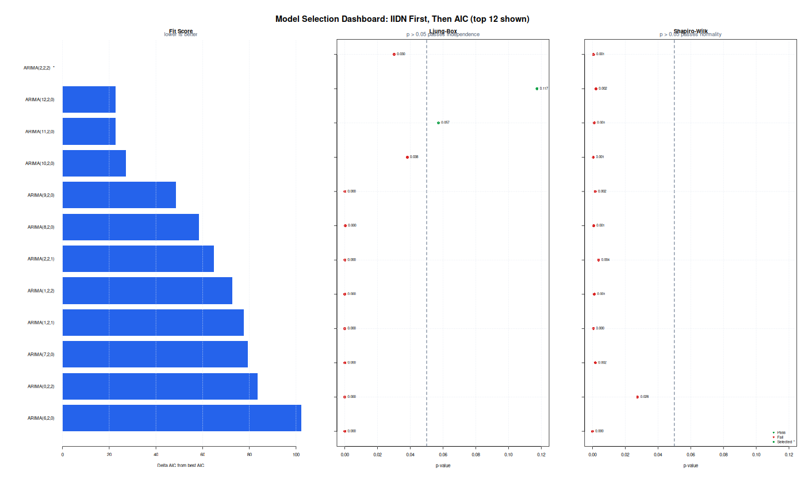

**Selected decision model:** `ARIMA(2,2,2)`

- **Selection rule:** evaluate IIDN for every candidate model first, then choose the lowest AIC among models that pass IIDN checks. If no candidate passes IIDN, choose the lowest-AIC fallback and document the diagnostic risk.
- **Selection result:** No candidate passed all IIDN checks, so the lowest-AIC candidate is selected as the fallback model.

**Final ARIMA model equation:**

General ARIMA form:

$$
\phi(B) (1 - B)^d Z_t = \theta_0 + \theta(B) a_t
$$

B: operator backshift (`BZ_t = Z_{t-1}`) - `a_t`: galat white noise - `theta_0`: konstanta.

Estimated model form:

$$
(1 - 1.3397B^{1} + 0.6822B^{2})(1 - B)^{2} Z_t = (1 - 1.9185B^{1} + 0.9186B^{2})a_t
$$

- **Decision model:** select `ARIMA(2,2,2)`. No candidate passed all IIDN checks, so the lowest-AIC candidate is selected as the fallback model.
- **Equation note:** MA signs follow the R forecast::Arima convention, so MA terms appear as plus/minus the estimated ma coefficient on the right side.

**Selected model coefficients:**

```text
  parameter   estimate  std_error   z_value       p_value
1       ar1  1.3397293 0.04835269  27.70744 5.679938e-169
2       ar2 -0.6822423 0.04698898 -14.51920  9.157714e-48
3       ma1 -1.9185474 0.03672208 -52.24506  0.000000e+00
4       ma2  0.9186191 0.03590052  25.58791 2.079995e-144
```

### 4. Diagnostic Checking IIDN

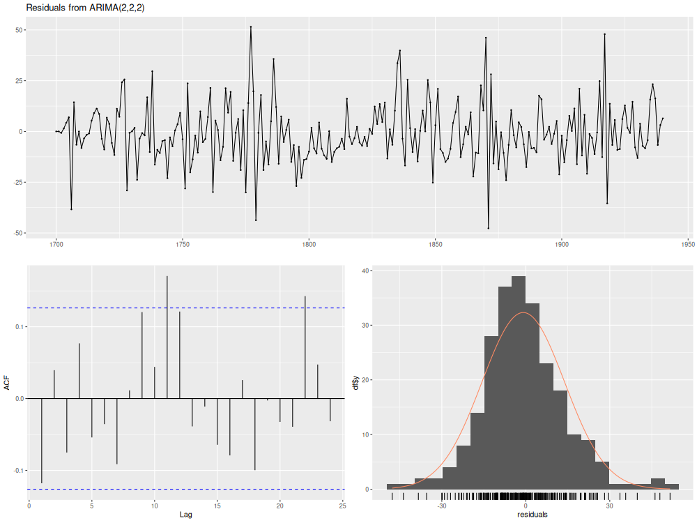

- **Mean residual:** -0.902321
- **Residual variance:** 218.037811
- **Independence test, Ljung-Box lag 6 p-value:** 0.0302
- **Normality test, Shapiro-Wilk p-value:** 0.0006
- **IIDN interpretation:** independent if Ljung-Box p-value > 0.05; normally distributed if Shapiro-Wilk p-value > 0.05; identically distributed is checked visually from residual plot and stable residual spread.

### 5. Forecasting

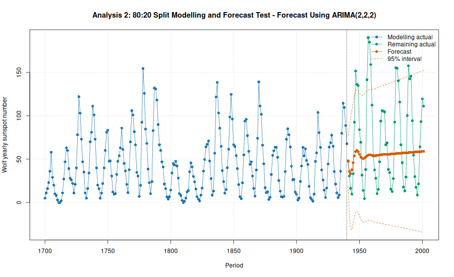

- **Forecast model:** `ARIMA(2,2,2)`
- **Forecast horizon:** 61 periods
- **MAE:** 44.2152
- **RMSE:** 54.6427
- **MAPE:** 111.64%
- **Forecast CSV:** `data/wolf_yearly_sunspot_numbers_w2_split_forecast.csv`

**Forecast values:**

```text
   period actual forecast  lower_95  upper_95       error absolute_error absolute_percentage_error
1    1941   47.5 48.00788  18.65007  77.36569  -0.5078803      0.5078803                 1.0692216
2    1942   30.6 35.85953 -15.24683  86.96590  -5.2595342      5.2595342                17.1880203
3    1943   16.3 33.12771 -30.87366  97.12908 -16.8277089     16.8277089               103.2374782
4    1944    9.6 37.79657 -31.13321 106.72634 -28.1965671     28.1965671               293.7142411
5    1945   33.2 45.95599 -23.77327 115.68525 -12.7559896     12.7559896                38.4216553
6    1946   92.6 53.74276 -15.98788 123.47341  38.8572359     38.8572359                41.9624577
7    1947  151.6 58.64888 -11.31118 128.60895  92.9511189     92.9511189                61.3134030
8    1948  136.3 59.94993 -10.15372 130.05358  76.3500673     76.3500673                56.0161903
9    1949  134.7 58.38648 -11.71576 128.48872  76.3135212     76.3135212                56.6544330
10   1950   83.9 55.44489 -14.92974 125.81952  28.4551090     28.4551090                33.9155053
11   1951   69.4 52.61126 -18.56238 123.78491  16.7887365     16.7887365                24.1912630
12   1952   31.5 50.86249 -21.42236 123.14735 -19.3624946     19.3624946                61.4682370
13   1953   13.9 50.49349 -22.82569 123.81267 -36.5934878     36.5934878               263.2625018
14   1954    4.4 51.23285 -22.82703 125.29274 -46.8328520     46.8328520              1064.3829992
15   1955   38.0 52.51580 -22.00250 127.03410 -14.5158015     14.5158015                38.1994777
16   1956  141.7 53.77083 -21.03593 128.57759  87.9291693     87.9291693                62.0530482
17   1957  190.2 54.61760 -20.41434 129.64954 135.5824028    135.5824028                71.2841235
18   1958  184.8 54.93645 -20.33220 130.20510 129.8635493    129.8635493                70.2724834
19   1959  159.0 54.82658 -20.73954 130.39270 104.1734222    104.1734222                65.5178756
20   1960  112.3 54.50249 -21.44317 130.44816  57.7975080     57.7975080                51.4670597
21   1961   53.9 54.18391 -22.21155 130.57938  -0.2839143      0.2839143                 0.5267426
22   1962   37.5 54.01886 -22.86084 130.89856 -16.5188609     16.5188609                44.0502958
23   1963   27.9 54.05573 -23.30381 131.41527 -26.1557308     26.1557308                93.7481392
24   1964   10.2 54.25838 -23.55219 132.06896 -44.0583825     44.0583825               431.9449262
25   1965   15.1 54.54538 -23.68213 132.77288 -39.4453761     39.4453761               261.2276565
26   1966   47.0 54.83226 -23.78663 133.45116  -7.8322620      7.8322620                16.6643872
27   1967   93.8 55.06146 -23.93754 134.06047  38.7385383     38.7385383                41.2990813
28   1968  105.9 55.21345 -24.16777 134.59467  50.6865488     50.6865488                47.8626523
29   1969  105.5 55.30136 -24.47284 135.07555  50.1986442     50.1986442                47.5816532
30   1970  104.5 55.35608 -24.82446 135.53662  49.1439199     49.1439199                47.0276746
31   1971   66.6 55.41007 -25.18765 136.00780  11.1899269     11.1899269                16.8016921
32   1972   68.9 55.48572 -25.53474 136.50618  13.4142766     13.4142766                19.4691968
33   1973   38.0 55.59089 -25.85253 137.03430 -17.5908877     17.5908877                46.2918096
34   1974   34.5 55.72082 -26.14229 137.58392 -21.2208169     21.2208169                61.5096143
35   1975   15.5 55.86379 -26.41474 138.14231 -40.3637891     40.3637891               260.4115426
36   1976   12.6 56.00734 -26.68333 138.69801 -43.4073394     43.4073394               344.5026933
37   1977   27.5 56.14277 -26.95878 139.24431 -28.6427658     28.6427658               104.1555119
38   1978   92.5 56.26691 -27.24623 139.78006  36.2330860     36.2330860                39.1709038
39   1979  155.4 56.38149 -27.54529 140.30828  99.0185051     99.0185051                63.7184717
40   1980  154.6 56.49095 -27.85193 140.83384  98.1090473     98.1090473                63.4599271
41   1981  140.4 56.60007 -28.16099 141.36114  83.7999258     83.7999258                59.6865568
42   1982  115.9 56.71224 -28.46833 141.89281  59.1877598     59.1877598                51.0679550
43   1983   66.6 56.82871 -28.77190 142.42933   9.7712855      9.7712855                14.6715998
44   1984   45.9 56.94888 -29.07180 142.96957 -11.0488838     11.0488838                24.0716423
45   1985   17.9 57.07106 -29.36953 143.51166 -39.1710639     39.1710639               218.8327595
46   1986   13.4 57.19342 -29.66706 144.05389 -43.7934172     43.7934172               326.8165464
47   1987   29.4 57.31463 -29.96597 144.59524 -27.9146306     27.9146306                94.9477231
48   1988  100.2 57.43420 -30.26707 145.13547  42.7658013     42.7658013                42.6804404
49   1989  157.6 57.55234 -30.57032 145.67500 100.0476598    100.0476598                63.4820176
50   1990  142.6 57.66969 -30.87514 146.21453  84.9303070     84.9303070                59.5584200
51   1991  145.7 57.78696 -31.18078 146.75470  87.9130376     87.9130376                60.3383923
52   1992   94.3 57.90466 -31.48661 147.29592  36.3953418     36.3953418                38.5952723
53   1993   54.6 58.02298 -31.79231 147.83827  -3.4229821      3.4229821                 6.2691979
54   1994   29.9 58.14186 -32.09787 148.38158 -28.2418565     28.2418565                94.4543697
55   1995   17.5 58.26104 -32.40351 148.92559 -40.7610402     40.7610402               232.9202296
56   1996    8.6 58.38026 -32.70949 149.47002 -49.7802623     49.7802623               578.8402596
57   1997   21.5 58.49933 -33.01607 150.01472 -36.9993252     36.9993252               172.0898846
58   1998   64.3 58.61815 -33.32335 150.55964   5.6818517      5.6818517                 8.8364723
59   1999   93.3 58.73676 -33.63132 151.10484  34.5632410     34.5632410                37.0452743
60   2000  119.6 58.85525 -33.93991 151.65041  60.7447514     60.7447514                50.7899259
61   2001  111.0 58.97372 -34.24900 152.19644  52.0262791     52.0262791                46.8705217
```

## W2 Analysis Summary

Series W2 contains annual Wolf sunspot numbers from 1700 through 2001. Because this is a long annual series with visible cyclical behavior, the workflow lets the stationarity checks decide whether differencing is required before ARIMA order identification.

- Full-data selected model: `ARIMA(12,2,0)`.
- Full-data differencing order used for identification: `d = 2`.
- 80:20 split selected model: `ARIMA(2,2,2)`.
- 80:20 split differencing order used for identification: `d = 2`.
- 80:20 split accuracy: MAE = 44.2152, RMSE = 54.6427, MAPE = 111.64%.

The stationarity decision diagrams and ACF/PACF plots are written under `plots_rstudio/w2`, separate from W1 outputs.

